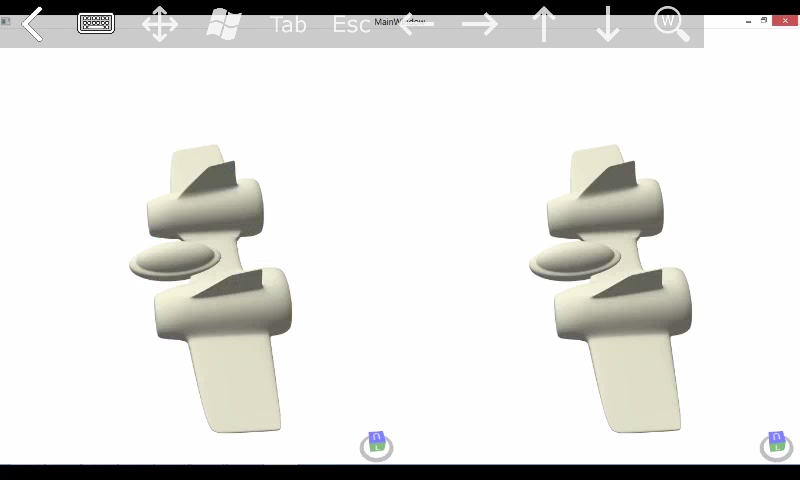

# SpaceShipConstructor prototype

This is a virtual reality prototype written in C# using Helix opensource library, which helps to visualize 3d models in wpf applications.
The application runs on PC and the desktop should be streamed into the smartphone which should be placed into "Google Cardboard" like head mounted display.

Here is a screenshot made on Android smartphone with a streaming client launched. It shows the application running on the PC.  

  

The model of a spaceship made in 3ds max and exported to .obj file which then is loaded by Helix into WPF application
